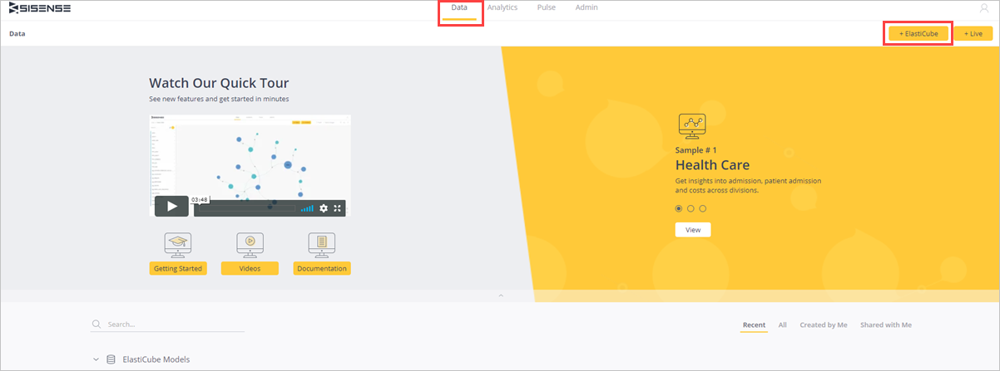
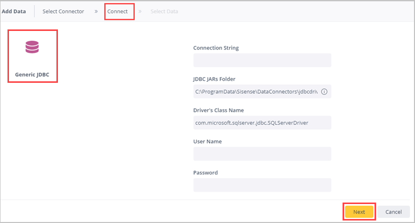
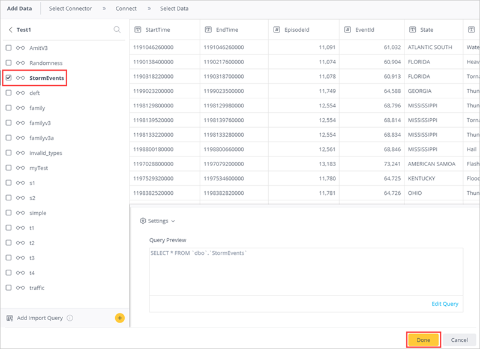
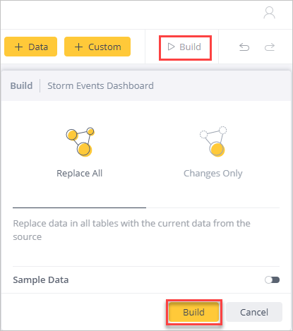
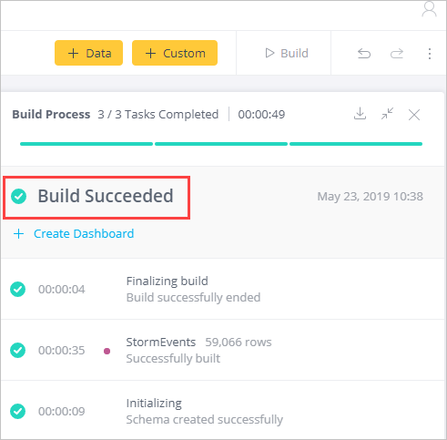
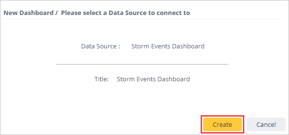
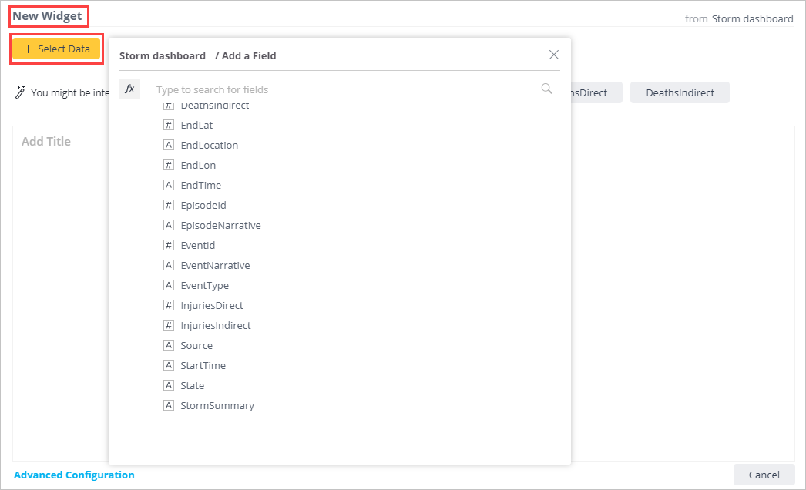
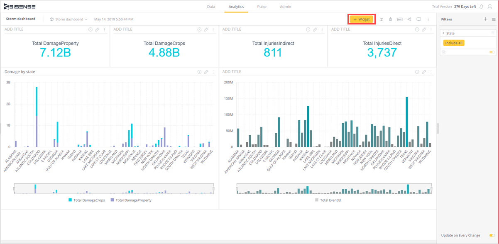

# Visualize data from Azure Data Explorer in Sisense

Sisense is an analytics business intelligence platform that enables you to build analytics apps that deliver highly interactive user experiences. The business intelligence and dashboard reporting software allow you to access and combine data in a few clicks. You can connect to structured and unstructured data sources, join tables from multiple sources with minimal scripting and coding, and create interactive web dashboards and reports. In this article, you will learn how to set up Azure Data Explorer as a data source for Sisense, and visualize data from a sample cluster.

## Prerequisites

You need the following to complete this article:

* [Download and install Sisense app](https://documentation.sisense.com/latest/getting-started/download-install.htm) 

* Create a cluster and database that includes the StormEvents sample data. For more information, see [Quickstart: Create an Azure Data Explorer cluster and database](create-cluster-database-portal.md) and [Ingest sample data into Azure Data Explorer](ingest-sample-data.md).

    [!INCLUDE [data-explorer-storm-events](../../includes/data-explorer-storm-events.md)]

## Connect to Sisense dashboards using Azure Data Explorer JDBC connector

1. Download and copy the latest versions of the following jar files to *..\Sisense\DataConnectors\jdbcdrivers\adx* 

    * activation-1.1.jar
    * adal4j-1.6.0.jar
    * commons-codec-1.10.jar
    * commons-collections4-4.1.jar
    * commons-lang3-3.5.jar
    * gson-2.8.0.jar
    * jcip-annotations-1.0-1.jar
    * json-smart-1.3.1.jar
    * lang-tag-1.4.4.jar
    * mail-1.4.7.jar
    * mssql-jdbc-7.2.1.jre8.jar
    * nimbus-jose-jwt-7.0.1.jar
    * oauth2-oidc-sdk-5.24.1.jar
    * slf4j-api-1.7.21.jar
    
1. Open **Sisense** app.
1. Select **Data** tab and select **+ElastiCube** to create a new ElastiCube model.
    
    

1. In **Add new ElastiCube Model**, name the ElastiCube model and **Save**.
   
    

1. Select **+ Data**.

    

1. In **Select Connector** tab, select **Generic JDBC** connector.

    

1. In the **Connect** tab, complete the following fields for the **Generic JDBC** connector and select **Next**.

    

    |Field |Description |
    |---------|---------|
    |Connection String     |   `jdbc:sqlserver://<cluster_name.region>.kusto.windows.net:1433;database=<database_name>;encrypt=true;trustServerCertificate=false;hostNameInCertificate=*.kusto.windows.net;loginTimeout=30;authentication=ActiveDirectoryPassword`      |
    |JDBC JARs folder  |    `..\Sisense\DataConnectors\jdbcdrivers\adx`     |
    |Driver's Class Name    |   `com.microsoft.sqlserver.jdbc.SQLServerDriver`      |
    |User Name   |    AAD user name     |
    |Password     |   AAD user password      |

1. In the **Select Data** tab, search **Select Database** to select the relevant database to which you have permissions. In this example, select *test1*.

    

1. In *test* (database name) pane:
    1. Select the table name to preview the table and see the table column names. You can remove unnecessary columns.
    1. Select the check box of the relevant table to select that table. 
    1. Select **Done**.

        

1. Select **Build** to build your dataset. 

    * In the **Build** window, select **Build**.

    

    * Wait until build process is complete and **Build Succeeded**.

    

1. In **Analytics** tab, select **+** > **New Dashboard** to start building dashboards on top of this dataset.

    

1. Pick a dashboard and select **Create**. 

    

1. In **Storm Events Dashboard** under **New Widget**, select **+ Select Data** to create a new widget. 

      

1. **+ Add More Data** to add additional columns to your graph. 

    

1. Select **+ Widget** to create another widget. Drag and drop widgets to rearrange your dashboard.

    

## Next steps

* [Write queries for Azure Data Explorer](write-queries.md)

