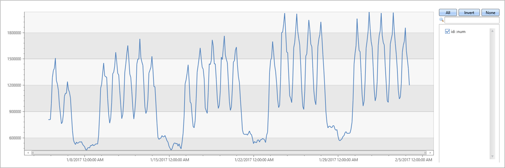

# Time series analysis in Azure Data Explorer

Azure Data Explorer (ADX) performs on-going collection of telemetry data from cloud services or IoT devices. This data can be analyzed for various insights such as monitoring service health, physical production processes, and usage trends. Analysis is done on time series of selected metrics to find a deviation in the pattern compared to its typical baseline pattern.
ADX contains native support for creation, manipulation, and analysis of multiple time series. 
In this topic, learn how Azure Data Explorer is used to create and analyze **thousands of time series in seconds**, enabling near real-time monitoring solutions and workflows.

## Time series creation

In this section, we'll create a large set of regular time series simply and intuitively using the `make-series` operator, and fill-in missing values as needed.
The first step in time series analysis is to partition and transform the original telemetry table to a set of time series. The table usually contains a timestamp column, contextual dimensions, and optional metrics. The dimensions are used to partition the data. The goal is to create thousands of time series per partition at regular time intervals.

The input table *demo_make_series1* contains 600K records of arbitrary web service traffic. Use the command below to sample 10 records:

**\[**[**Click to run query**](https://dataexplorer.azure.com/clusters/help/databases/Samples?query=H4sIAAAAAAAAA0tJzc2Pz03MTo0vTi3KTC02VKhRKAFyFQwNADOyzKUbAAAA)**\]**

```kusto
demo_make_series1 | take 10 
```

The resulting table contains a timestamp column, three contextual dimensions columns, and no metrics:

| TimeStamp | BrowserVer | OsVer | Country/Region |
| --- | --- | --- | --- |
| 2016-08-25 09:12:35.4020000 | Chrome 51.0 | Windows 7 | United Kingdom |
| 2016-08-25 09:12:41.1120000 | Chrome 52.0 | Windows 10 |   |
| 2016-08-25 09:12:46.2300000 | Chrome 52.0 | Windows 7 | United Kingdom |
| 2016-08-25 09:12:46.5100000 | Chrome 52.0 | Windows 10 | United Kingdom |
| 2016-08-25 09:12:46.5570000 | Chrome 52.0 | Windows 10 | Republic of Lithuania |
| 2016-08-25 09:12:47.0470000 | Chrome 52.0 | Windows 8.1 | India |
| 2016-08-25 09:12:51.3600000 | Chrome 52.0 | Windows 10 | United Kingdom |
| 2016-08-25 09:12:51.6930000 | Chrome 52.0 | Windows 7 | Netherlands |
| 2016-08-25 09:12:56.4240000 | Chrome 52.0 | Windows 10 | United Kingdom |
| 2016-08-25 09:13:08.7230000 | Chrome 52.0 | Windows 10 | India |

Since there are no metrics, we can only build a set of time series representing the traffic count itself, partitioned by OS using the following query:

**\[**[**Click to run query**](https://dataexplorer.azure.com/clusters/help/databases/Samples?query=H4sIAAAAAAAAA5XPwQrCMBAE0Hu/Yo4NVLBn6Td4ULyWtV1tMJtIsoEq/XhbC4J48jgw+5h1rBDrW0UDDakjR7HsWUIrdOM2cbScakxIWYSiffJSL49W+KAkd2N2hVsMGv8yaPw2furFhCVu1gifpelC9loa9Hyh7LTZInh8FFiPSP7K5fufap1UoR4Mzg/s04njjEb2PUfofNYNFPUFtJiguAEBAAA=)**\]**

```kusto
let min_t = toscalar(demo_make_series1 | summarize min(TimeStamp));
let max_t = toscalar(demo_make_series1 | summarize max(TimeStamp));
demo_make_series1
| make-series num=count() default=0 on TimeStamp in range(min_t, max_t, 1h) by OsVer
| render timechart 
```

- Use the [`make-series`](kusto/query/make-seriesoperator.md) operator to create a set of three time series, where:
    - `num=count()`: time series of traffic
    - `range(min_t, max_t, 1h)`: time series is created in 1-hour bins in the time range (oldest and newest timestamps of table records)
    - `default=0`: specify fill method for missing bins to create regular time series. Alternatively use [`series_fill_const()`](kusto/query/series-fill-constfunction.md), [`series_fill_forward()`](kusto/query/series-fill-forwardfunction.md), [`series_fill_backward()`](kusto/query/series-fill-backwardfunction.md) and [`series_fill_linear()`](kusto/query/series-fill-linearfunction.md) for changes
    - `byOsVer`:  partition by OS
- The actual time series data structure is a numeric array of the aggregated value per each time bin. We use `render timechart` for visualization.

In the table above, we have three partitions. We can create a separate time series: Windows 10 (red), 7 (blue) and 8.1 (green) for each OS version as seen in the graph:


## Time series analysis functions

In this section, we'll perform typical series processing functions.
Once a set of time series is created, Azure Data Explorer supports a growing list of functions to process and analyze them which can be found in the [time series documentation](kusto/query/machine-learning-and-tsa.md). We will describe a few representative functions for processing and analyzing time series.

### Filtering

Filtering is a common practice in signal processing and useful for time series processing tasks (for example, smooth a noisy signal, change detection).
- There are two generic filtering functions:
    - [`series_fir()`](kusto/query/series-firfunction.md): Applying FIR filter. Used for simple calculation of moving average and differentiation of the time series for change detection.
    - [`series_iir()`](kusto/query/series-iirfunction.md): Applying IIR filter. Used for exponential smoothing and cumulative sum.
- `Extend` the time series set by adding a new moving average series of size 5 bins (named *ma_num*) to the query:

**\[**[**Click to run query**](https://dataexplorer.azure.com/clusters/help/databases/Samples?query=H4sIAAAAAAAAA5WPQavCMBCE7/6KOSYQ4fXgSfobPDx517C2q4bXpLLZQBV/vKkFQTx5WRh25tvZgRUxJK9ooWPuaCAxPcfRR/pnn1kC5wZ35BIjSbjxbDf7EPlXKV6s3a6GmUHTVwya3hkf9tUds1wvEqnEthtLUmPR85HKoO0PxoQXBSFBKJ3YPP9xSyWH5mxxuGKX/1gqlCfl1Neln5EL3R+DmCodhC9MahqHjXVQKbxMW5NScyzQerA7k+gDa1tswzsBAAA=)**\]**

```kusto
let min_t = toscalar(demo_make_series1 | summarize min(TimeStamp));
let max_t = toscalar(demo_make_series1 | summarize max(TimeStamp));
demo_make_series1
| make-series num=count() default=0 on TimeStamp in range(min_t, max_t, 1h) by OsVer
| extend ma_num=series_fir(num, repeat(1, 5), true, true)
| render timechart
```


### Regression analysis

ADX supports segmented linear regression analysis to estimate the trend of the time series.
- Use [series_fit_line()](kusto/query/series-fit-linefunction.md) to fit the best line to a time series for general trend detection.
- Use [series_fit_2lines()](kusto/query/series-fit-2linesfunction.md) to detect trend changes, relative to the baseline, that are useful in monitoring scenarios.

Example of `series_fit_line()` and  `series_fit_2lines()` functions in a time series query:

**\[**[**Click to run query**](https://dataexplorer.azure.com/clusters/help/databases/Samples?query=H4sIAAAAAAAAA0tJzc2PL04tykwtNuKqUUitKEnNS1GACMSnZZbEG+Vk5qUWa1Rq6iCLggSBYkAdRUD1qUUKIIHkjMSiEoXyzJIMjYrk/JzS3DzbCk0AUIIJ02EAAAA=)**\]**

```kusto
demo_series2
| extend series_fit_2lines(y), series_fit_line(y)
| render linechart with(xcolumn=x)
```


- Blue: original time series
- Green: fitted line
- Red: two fitted lines

> [!NOTE]
> The function accurately detected the jump (level change) point.

### Seasonality detection

Many metrics follow seasonal (periodic) patterns. User traffic of cloud services usually contains daily and weekly patterns that are highest around the middle of the business day and lowest at night and over the weekend. IoT sensors measure in periodic intervals. Physical measurements such as temperature, pressure, or humidity may also show seasonal behavior.

The following example applies seasonality detection on one month traffic of a web service (2-hour bins):

**\[**[**Click to run query**](https://dataexplorer.azure.com/clusters/help/databases/Samples?query=H4sIAAAAAAAAA0tJzc2PL04tykwtNuaqUShKzUtJLVIoycxNTc5ILCoBAHrjE80fAAAA)**\]**

```kusto
demo_series3
| render timechart 
```



- Use [series_periods_detect()](kusto/query/series-periods-detectfunction.md) to automatically detect the periods in the time series. 
- Use [series_periods_validate()](kusto/query/series-periods-validatefunction.md) if we know that a metric should have specific distinct period(s) and we want to verify that they exist.

> [!NOTE]
> It's an anomaly if specific distinct periods don't exist

**\[**[**Click to run query**](https://dataexplorer.azure.com/clusters/help/databases/Samples?query=H4sIAAAAAAAAA12OwQ6CMBBE737FHKmpVtAr39IguwkYyzZ0IZj48TZSLx533szOEAfxieeR0/XwRpzlwb2iilkSShapl5mTQYvd5QvxxJqd1bQEi8vZor6RawaLxsA5FewcOjBKBOP0PXUMXL7lyrCeeIvdRPjrzIw35Qyoe6W2GY4qJMv9yb91xtX0AS7N323BAAAA)**\]**

```kusto
demo_series3
| project (periods, scores) = series_periods_detect(num, 0., 14d/2h, 2) //to detect the periods in the time series
| mv-expand periods, scores
| extend days=2h*todouble(periods)/1d
```

| periods | scores | days |
| --- | --- | --- |
| 84 | 0.820622786055595 | 7 |
| 12 | 0.764601405803502 | 1 |

The function detects daily and weekly seasonality. The daily scores less than the weekly because weekend days are different from weekdays.

### Element-wise functions

Arithmetic and logical operations can be done on a time series. Using [series_subtract()](kusto/query/series-subtractfunction.md) we can calculate a residual time series, that is, the difference between original raw metric and a smoothed one, and look for anomalies in the residual signal:

**\[**[**Click to run query**](https://dataexplorer.azure.com/clusters/help/databases/Samples?query=H4sIAAAAAAAAA5WQQU/DMAyF7/sVT5waqWjrgRPqb+AAgmPltR6LSNLJcdhA+/G4izRAnLhEerbfl2cHVkSfBkUPnfNIgaSZOM5DpDceMovn3OGMXGIk8Z+8jDdPPvKjUjw4d78KC4NO/2LQ6Tfjz/jqjEXeVolUYj/OJWnjMPGOStB+gznhSoFPEEqv3Fz2aWukFt3eYfuBh/zMYlA+KafJmsOCrPRh56Ux2UL4wKRN1+LOtVApXF/37RTOfioUfvpz2arQqBVS2Q7rtc6wa4wlkPLVCLXIqE7DHvcsXOOh73Hz4tM0HzO6zQ1gDOx8UOvZrtayst0Y7z4babkkYQxMyQbGPYnCiGIxTS/fXGpfwk+n7uQBAAA=)**\]**

```kusto
let min_t = toscalar(demo_make_series1 | summarize min(TimeStamp));
let max_t = toscalar(demo_make_series1 | summarize max(TimeStamp));
demo_make_series1
| make-series num=count() default=0 on TimeStamp in range(min_t, max_t, 1h) by OsVer
| extend ma_num=series_fir(num, repeat(1, 5), true, true)
| extend residual_num=series_subtract(num, ma_num) //to calculate residual time series
| where OsVer == "Windows 10"   // filter on Win 10 to visualize a cleaner chart 
| render timechart
```


- Blue: original time series
- Red: smoothed time series
- Green: residual time series

## Time series workflow at scale

The example below shows how these functions can run at scale on thousands of time series in seconds for anomaly detection. To see a few sample telemetry records of a DB service's read count metric over four days run the following query:

**\[**[**Click to run query**](https://dataexplorer.azure.com/clusters/help/databases/Samples?query=H4sIAAAAAAAAA0tJzc2Pz03Mq4wvTi3KTC025KpRKEnMTlUwAQArfAiiGgAAAA==)**\]**

```kusto
demo_many_series1
| take 4 
```

| TIMESTAMP | Loc | anonOp | DB | DataRead |
| --- | --- | --- | --- | --- |
| 2016-09-11 21:00:00.0000000 | Loc 9 | 5117853934049630089 | 262 | 0 |
| 2016-09-11 21:00:00.0000000 | Loc 9 | 5117853934049630089 | 241 | 0 |
| 2016-09-11 21:00:00.0000000 | Loc 9 | -865998331941149874 | 262 | 279862 |
| 2016-09-11 21:00:00.0000000 | Loc 9 | 371921734563783410 | 255 | 0 |

And simple statistics:

**\[**[**Click to run query**](https://dataexplorer.azure.com/clusters/help/databases/Samples?query=H4sIAAAAAAAAA0tJzc2Pz03Mq4wvTi3KTC025KpRKC7NzU0syqxKVcgrzbVNzi/NK9HQ1FHIzcyLL7EFkhohnr6uwSGOvgEg0cQKkGhiBZIoAEq2dK9VAAAA)**\]**

```kusto
demo_many_series1
| summarize num=count(), min_t=min(TIMESTAMP), max_t=max(TIMESTAMP) 
```

| num | min\_t | max\_t |
| --- | --- | --- |
| 2177472 | 2016-09-08 00:00:00.0000000 | 2016-09-11 23:00:00.0000000 |

Building a time series in 1-hour bins of the read metric (total four days * 24 hours = 96 points), results in normal pattern fluctuation:

**\[**[**Click to run query**](https://dataexplorer.azure.com/clusters/help/databases/Samples?query=H4sIAAAAAAAAA5WPMQvCMBSE9/6KGxOoYGfpIOjgUBDtXh7twwabFF6ittIfb2rBQSfHg+8+7joOsMZVATlC72vqSFTDtq8subHyLIZ9hgn+Zi2JefKMq/JQ7M/ltjhqvQGSbrbQ8JeFhm/LTyGZInbl1RIhTI3P6X5ROwp0ikmjd/hYYByE3IXV+1G6TEqRtTqahF3DgmAs1y1JwMOEVo0Rzdf6BbBH5FAHAQAA)**\]**

```kusto
let min_t = toscalar(demo_many_series1 | summarize min(TIMESTAMP));  
let max_t = toscalar(demo_many_series1 | summarize max(TIMESTAMP));  
demo_many_series1
| make-series reads=avg(DataRead) on TIMESTAMP in range(min_t, max_t, 1h)
| render timechart with(ymin=0) 
```


The above behavior is misleading, since the single normal time series is aggregated from thousands of different instances that may have abnormal patterns. Therefore, we create a time series per instance. An instance is defined by Loc (location), anonOp (operation), and DB (specific machine).

How many time series can we create?

**\[**[**Click to run query**](https://dataexplorer.azure.com/clusters/help/databases/Samples?query=H4sIAAAAAAAAA0tJzc2Pz03Mq4wvTi3KTC025KpRKC7NzU0syqxKVUiqVPDJT9ZR8C/QUXBxAkol55fmlQAAWEsFxjQAAAA=)**\]**

```kusto
demo_many_series1
| summarize by Loc, Op, DB
| count
```

| Count |
| --- |
| 18339 |

Now, we're going to create a set of 18339 time series of the read count metric. We add the `by` clause to the make-series statement, apply linear regression, and select the top two time series that had the most significant decreasing trend:

**\[**[**Click to run query**](https://dataexplorer.azure.com/clusters/help/databases/Samples?query=H4sIAAAAAAAAA5WPsU7DQBBE+3zFdLmTTGHSgFAKUCiQiIKIe2u5rJ0T9l3YWwcH5eO5JBIFVJSzmnmz07Gi96FWzKExOepIzIb7WPcUDnVi8ZxKHJGGvifxX3yym+pp+biu7pcv1t4Bk+5EofFfFBp/U/4EJsdse+eri4QwbdKc9q1ZkNJrVhYx4IcCHyAUWjbnRcXlpQLl1uLtgOfoCqx2BRYPGcyjctjASPoYSLhA6uKObR5waasbr3XnA5tzrc0RjTtcn0hnKyg55KtkDAvU9+y2JIpPr1ujXjueT9cse+8YlVDTeIfVoNQymiiZ5ENSCi4vM3FQxAblzWx2a6f2G2UcBRyWAQAA)**\]**

```kusto
let min_t = toscalar(demo_many_series1 | summarize min(TIMESTAMP));  
let max_t = toscalar(demo_many_series1 | summarize max(TIMESTAMP));  
demo_many_series1
| make-series reads=avg(DataRead) on TIMESTAMP in range(min_t, max_t, 1h) by Loc, Op, DB
| extend (rsquare, slope) = series_fit_line(reads)
| top 2 by slope asc 
| render timechart with(title='Service Traffic Outage for 2 instances (out of 18339)')
```


Display the instances:

**\[**[**Click to run query**](https://dataexplorer.azure.com/clusters/help/databases/Samples?query=H4sIAAAAAAAAA5WPvW4CMRCEe55iSlsyBWkjChApIoESAb21udsQg38O26AD8fDx3SEUJVXKWc18s2M5wxmvM6bIIVVkKYqaXdCO/EUnjobTBDekk3MUzZU7u9i+rl4229nqXcpnYGQ7CrX/olD7m/InMLoV24HHg0RkqtOUzjuxoEzroiSCx4MC4xHJ71j0i9TwksLkS+LjgmWoFN4ahcW8gLnN7GuImI4niqyQbGhYlgFDm/40WVvjWfS1skRyaPDUkXorKFXl2MSw5yr/pN9Z31SyxuhbAQAA)**\]**

```kusto
let min_t = toscalar(demo_many_series1 | summarize min(TIMESTAMP));  
let max_t = toscalar(demo_many_series1 | summarize max(TIMESTAMP));  
demo_many_series1
| make-series reads=avg(DataRead) on TIMESTAMP in range(min_t, max_t, 1h) by Loc, Op, DB
| extend (rsquare, slope) = series_fit_line(reads)
| top 2 by slope asc
| project Loc, Op, DB, slope 
```

| Loc | Op | DB | slope |
| --- | --- | --- | --- |
| Loc 15 | 37 | 1151 | -102743.910227889 |
| Loc 13 | 37 | 1249 | -86303.2334644601 |

In less than two minutes, Azure Data Explorer analyzed close to 20,000 time series and detected two abnormal time series in which the read count suddenly dropped.

These advanced capabilities combined with Azure Data Explorer fast performance supply a unique and powerful solution for time series analysis.

## Next steps

* Learn about [Time series anomaly detection and forecasting](anomaly-detection.md) in Azure Data Explorer.
* Learn about [Machine learning capabilities](machine-learning-clustering.md) in Azure Data Explorer.