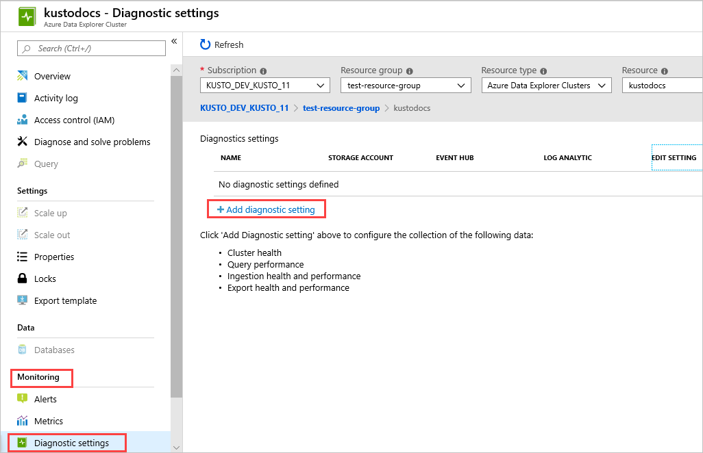
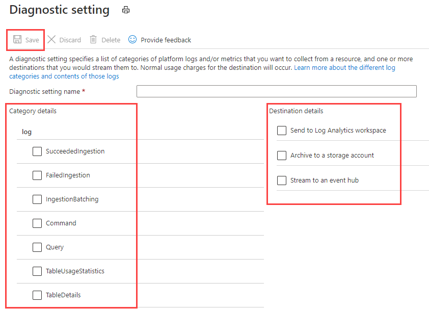

# Monitor Azure Data Explorer ingestion operations using diagnostic logs

Azure Data Explorer is a fast, fully managed data analytics service for real-time analysis on large volumes of data streaming from applications, websites, IoT devices, and more. To use Azure Data Explorer, you first create a cluster, and create one or more databases in that cluster. Then you ingest (load) data into a table in a database so that you can run queries against it. [Azure Monitor diagnostic logs](/azure/azure-monitor/platform/diagnostic-logs-overview) provide data about the operation of Azure resources. Azure Data Explorer uses diagnostic logs for insights on ingestion successes and failures. You can export operation logs to Azure Storage, Event Hub, or Log Analytics to monitor ingestion status. Logs from Azure Storage and Azure Event Hub can be routed to a table in your Azure Data Explorer cluster for further analysis.

## Prerequisites

* If you don't have an Azure subscription, create a [free Azure account](https://azure.microsoft.com/free/).
* Create a [cluster and database](create-cluster-database-portal.md).

## Sign in to the Azure portal

Sign in to the [Azure portal](https://portal.azure.com/).

## Set up diagnostic logs for an Azure Data Explorer cluster

Diagnostic logs can be used to configure the collection of the following log data:
* Successful ingestion operations: These logs have information about successfully completed ingestion operations.
* Failed ingestion operations: These logs have detailed information about failed ingestion operations including error details. 

The data is then archived into a Storage account, streamed to an Event Hub, or sent to Log Analytics, as per your specifications.

### Enable diagnostic logs

Diagnostic logs are disabled by default. To enable diagnostic logs, do the following steps:

1. In the [Azure portal](https://portal.azure.com), select the Azure Data Explorer cluster resource that you want to monitor.
1. Under **Monitoring**, select **Diagnostic settings**.
  
    

1. Select **Add diagnostic setting**.
1. In the **Diagnostics settings** window:
 
     

    1. Select **Name** for your diagnostic setting.
    1. Select one or more targets: a Storage account, Event Hub, or Log Analytics.
    1. Select logs to be collected: `SucceededIngestion` or `FailedIngestion`.
    1. Select [metrics](using-metrics.md#supported-azure-data-explorer-metrics) to be collected (optional).  
    1. Select **Save** to save the new diagnostic logs settings and metrics.

New settings will be set in a few minutes. Logs then appear in the configured archival target (Storage account, Event Hub, or Log Analytics). 

## Diagnostic logs schema

All [Azure Monitor diagnostic logs share a common top-level schema](/azure/azure-monitor/platform/diagnostic-logs-schema). Azure Data Explorer has unique properties for their own events. All logs are stored in a JSON format.

### Ingestion logs schema

Log JSON strings include elements listed in the following table:

|Name               |Description
|---                |---
|time               |Time of the report
|resourceId         |Azure Resource Manager resource ID
|operationName      |Name of the operation: 'MICROSOFT.KUSTO/CLUSTERS/INGEST/ACTION'
|operationVersion   |Schema version: '1.0' 
|category           |Category of the operation. `SucceededIngestion` or `FailedIngestion`. Properties differ for [successful operation](#successful-ingestion-operation-log) or [failed operation](#failed-ingestion-operation-log).
|properties         |Detailed information of the operation.

#### Successful ingestion operation log

**Example:**

```json
{
    "time": "",
    "resourceId": "",
    "operationName": "MICROSOFT.KUSTO/CLUSTERS/INGEST/ACTION",
    "operationVersion": "1.0",
    "category": "SucceededIngestion",
    "properties":
    {
        "succeededOn": "2019-05-27 07:55:05.3693628",
        "operationId": "b446c48f-6e2f-4884-b723-92eb6dc99cc9",
        "database": "Samples",
        "table": "StormEvents",
        "ingestionSourceId": "66a2959e-80de-4952-975d-b65072fc571d",
        "ingestionSourcePath": "https://kustoingestionlogs.blob.core.windows.net/sampledata/events8347293.json",
        "rootActivityId": "d0bd5dd3-c564-4647-953e-05670e22a81d"
    }
}
```
**Properties of a successful operation diagnostic log**

|Name               |Description
|---                |---
|succeededOn        |Time of ingestion completion
|operationId        |Azure Data Explorer ingestion operation ID
|database           |Name of the target database
|table              |Name of the target table
|ingestionSourceId  |ID of the ingestion data source
|ingestionSourcePath|Path of the ingestion data source or blob URI
|rootActivityId     |Activity ID

#### Failed ingestion operation log

**Example:**

```json
{
    "time": "",
    "resourceId": "",
    "operationName": "MICROSOFT.KUSTO/CLUSTERS/INGEST/ACTION",
    "operationVersion": "1.0",
    "category": "FailedIngestion",
    "properties":
    {
        "failedOn": "2019-05-27 08:57:05.4273524",
        "operationId": "5956515d-9a48-4544-a514-cf4656fe7f95",
        "database": "Samples",
        "table": "StormEvents",
        "ingestionSourceId": "eee56f8c-2211-4ea4-93a6-be556e853e5f",
        "ingestionSourcePath": "https://kustoingestionlogs.blob.core.windows.net/sampledata/events5725592.json",
        "rootActivityId": "52134905-947a-4231-afaf-13d9b7b184d5",
        "details": "Permanent failure downloading blob. URI: ..., permanentReason: Download_SourceNotFound, DownloadFailedException: 'Could not find file ...'",
        "errorCode": "Download_SourceNotFound",
        "failureStatus": "Permanent",
        "originatesFromUpdatePolicy": false,
        "shouldRetry": false
    }
}
```

**Properties of a failed operation diagnostic log**

|Name               |Description
|---                |---
|failedOn           |Time of ingestion completion
|operationId        |Azure Data Explorer ingestion operation ID
|database           |Name of the target database
|table              |Name of the target table
|ingestionSourceId  |ID of the ingestion data source
|ingestionSourcePath|Path of the ingestion data source or blob URI
|rootActivityId     |Activity ID
|details            |Detailed description of the failure and error message
|errorCode          |Error code 
|failureStatus      |`Permanent` or `Transient`. Retry of a transient failure may succeed.
|originatesFromUpdatePolicy|True if failure originates from an update policy
|shouldRetry        |True if retry may succeed

## Next steps

* [Tutorial: Ingest and query monitoring data in Azure Data Explorer](ingest-data-no-code.md)
* [Use metrics to monitor cluster health](using-metrics.md)

