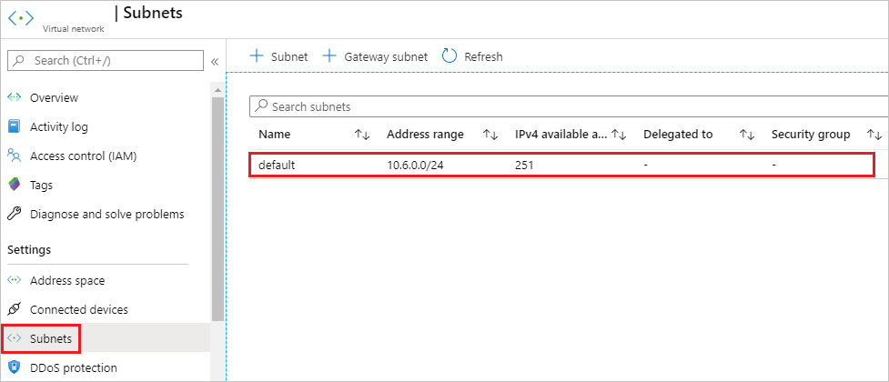
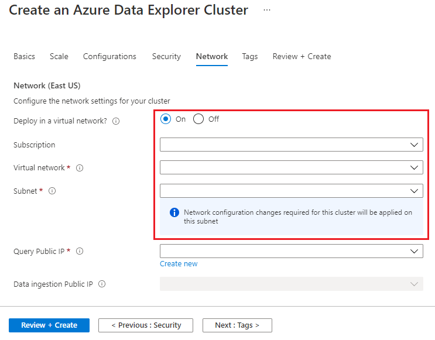

# Create an Azure Data Explorer cluster in your virtual network

Azure Data Explorer supports deploying a cluster into a subnet in your virtual network (VNet). This capability enables you to access the cluster privately from your Azure virtual network or on-premises, access resource such as Event Hub and Storage inside your virtual network, and restrict inbound and outbound traffic.

## Prerequisites

* If you don't have an Azure subscription, create a [free Azure account](https://azure.microsoft.com/free/) before you begin.
* Sign in to the [Azure portal](https://portal.azure.com/).

## Create Network Security Group (NSG)

[Network Security Groups (NSG)](/azure/virtual-network/security-overview) provide the ability to control network access within a VNet. Azure Data Explorer can be accessed using two endpoints HTTPs (443) and TDS (1433). The following NSG rules must be configured to allow access to these endpoints for management, monitoring, and proper operation of your cluster.

To create the network security group:

1. Select the **+ Create a resource** button in the upper-left corner of the portal.
1. Search for *Network Security Group*.
1. Under **Network Security Group**, at the bottom of the screen, select **Create**.
1. In the **Create network security group** window, fill out the following information.

   

    **Setting** | **Suggested value** | **Field description**
    |---|---|---|
    | Subscription | Your subscription | Select the Azure subscription that you want to use for your cluster.|
    | Resource group | Your resource group | Use an existing resource group or create a new resource group. |
    | Name | AzureDataExplorerNsg | Choose a name that identifies your Network Security Group (NSG) in the resource group.  |
    | Region | *West US* | Select the region that best meets your needs.
    | | | |

1. Select **Review + create** to review your cluster details, and **Create** to provision the cluster.

1. When the deployment is complete, select **Go to resource**.

    

1. In the **Inbound security rules** tab, select **+Add**.
1. In the **Add inbound security rule** window, fill out the following information.

    

    **Setting** | **Suggested value** 
    |---|---|
    | Source | ServiceTag
    | Source service tag | AzureDataExplorerManagement
    | Source port ranges | *
    | Destination | VirtualNetwork
    | Destination port ranges | *
    | Protocol | TCP
    | Action | Allow
    | Priority | 100
    | Name | AllowAzureDataExplorerManagement
    | | |
    
1. Repeat the previous two steps for all inbound and outbound dependencies according to [dependencies for VNet deployment](vnet-deployment.md#dependencies-for-vnet-deployment). Alternatively, outbound rules can be replaced with single rule to allow *Internet* for ports 443 and 80.
    
    The NSG rules for inbound and outbound dependencies should look like this:

    

## Create public IP addresses

To create the query (Engine) public IP addresses:

1. Select the **+ Create a resource** button in the upper-left corner of the portal.
1. Search for *Public IP address*.
1. Under **Public IP address**, select **Create**.
1. In the **Create public IP address** pane, complete the following information.
   
   

    **Setting** | **Suggested value** | **Field description**
    |---|---|---|
    | IP Version | IPv4 | Select the IP version. We only support IPv4.|
    | Sku | Standard | We require **Standard** for query (Engine) URI endpoint. |
    | Name | engine-pip | Choose a name that identifies your public IP address in the resource group.
    | Subscription | Your subscription | Select the Azure subscription that you want to use for your public IP.|
    | Resource group | Your resource group | Use an existing resource group or create a new resource group. |
    | Location | *West US* | Select the region that best meets your needs.
    | | | |

1. Select **Create** to create the public IP address.

1. To create the ingestion (Data Management) public IP address, follow the same instructions.

## Create Virtual Network and subnet

To create the virtual network and subnet:

1. Select the **+ Create a resource** button in the upper-left corner of the portal.
1. Search for *Virtual Network*.
1. Under **Virtual Network**, at the bottom of the screen, select **Create**.
1. In the **Create virtual network** window, complete the following information.

   

    **Setting** | **Suggested value** | **Field description**
    |---|---|---|
    | Subscription | Your subscription | Select the Azure subscription that you want to use for your cluster.|
    | Resource group | Your resource group | Use an existing resource group or create a new resource group. |
    | Name | AzureDataExplorerVnet | Choose a name that identifies your virtual network in the resource group.
    | Region | *West US* | Select the region that best meets your needs.
    | | | |

    > [!NOTE]
    > For production workloads, plan your subnet size according to [plan subnet size in your VNet](vnet-deployment.md#plan-subnet-size-in-your-vnet)

1. Select **Review + create** to review your cluster details, and **Create** to provision the cluster.

1. When the deployment is complete, select **Go to resource**.
1. Go to **Subnets** blade and select the **default** subnet.
    
    

1. In your **default** subnet window:
    1. Select your **Network Security Group** from the drop-down menu. 
    1. Select your network security group name, in this case **AzureDataExplorerNsg**. 
    1. **Save**

    

## Create a cluster

Create an Azure Data Explorer cluster with a defined set of compute and storage resources in an Azure resource group as described in [create a cluster](create-cluster-database-portal.md#create-a-cluster).

1. Prior to finalizing cluster creation, in the **Create an Azure Data Explorer cluster** window, select the **Network** tab to provide virtual network details using the resources created in the previous tabs:

   

    **Setting** | **Suggested value** | **Field description**
    |---|---|---|
    | Subscription | Your subscription | Select the Azure subscription that you want to use for networking resources.|
    | Virtual Network | AzureDataExplorerVnet | Choose the virtual network created in the previous steps.
    | Subnet | default | Choose the subnet created in the previous steps.
    | Query Public IP | engine-pip | Choose the query public IP created in the previous steps.
    | Data ingestion Public IP | dm-pip | Choose the ingestion public IP created in the previous steps.
    | | | |

1. Select **Review + create** to create your cluster.
1. When the deployment is complete, select **Go to resource**.

To deploy your Azure Data Explorer cluster into your virtual network, use the [Deploy Azure Data Explorer cluster into your VNet](https://azure.microsoft.com/resources/templates/101-kusto-vnet/) Azure Resource Manager template.

## Next steps

> [!div class="nextstepaction"]
> [Deploy Azure Data Explorer into your Virtual Network](vnet-deployment.md)
