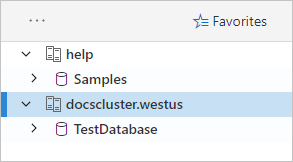
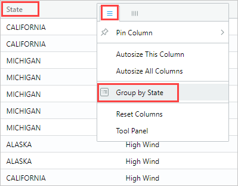
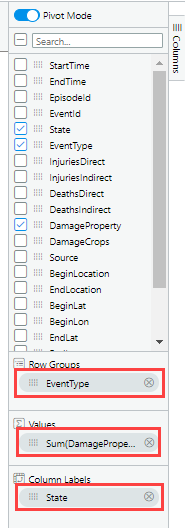

# Quickstart: Query data in Azure Data Explorer Web UI

Azure Data Explorer is a fast, fully managed data analytics service for real-time analysis of large volumes of data. Azure Data Explorer provides a web experience that enables you to connect to your Azure Data Explorer clusters and write, run, and share Kusto Query Language commands and queries. The web experience is available in the Azure portal and as a stand-alone web application, the [Azure Data Explorer Web UI](https://dataexplorer.azure.com). 
The Azure Data Explorer Web UI can also be hosted by other web portals in an HTML iframe. For more information on how to host the Web UI and the Monaco editor used, see [Monaco IDE integration](kusto/api/monaco/monaco-kusto.md).
In this quickstart, you'll be working in the stand-alone Azure Data Explorer Web UI.

:::image type="content" source="media/web-query-data/walkthrough.gif" alt-text="Walkthrough of the Kusto Web Explorer experience":::

## Prerequisites

* An Azure subscription. If you don’t have one, create a [free Azure account](https://azure.microsoft.com/free/) before you begin.
* Cluster and database with data. [Create your own cluster](create-cluster-database-portal.md) or use the Azure Data Explorer help cluster.

## Sign in to the application

Sign in to [the application](https://dataexplorer.azure.com/).

## Add clusters

When you first open the application, there are no cluster connections.


You must add a connection to a cluster before you can start running queries. In this section, you’ll add connections to the Azure Data Explorer **help** cluster and to the test cluster you've created in the [Prerequisites](#prerequisites) (optional).

### Add help cluster

1. In the upper left of the application, select **Add Cluster**.

1. In the **Add cluster** dialog box, enter the URI https://help.kusto.windows.net, then select **Add**.
   
1. In the left pane, you should now see the **help** cluster. Expand the **Samples** database and open the **Tables** folder to see the sample tables that you have access to.

    :::image type="content" source="media/web-query-data/help-cluster.png" alt-text="Find table in the help cluster":::

We use the **StormEvents** table later in this quickstart, and in other Azure Data Explorer articles. 

### Add your cluster

Now add the test cluster you created.

1. Select **Add Cluster**.

1. In the **Add Cluster** dialog box, enter your test cluster URL in the form `https://<ClusterName>.<Region>.kusto.windows.net/`, then select **Add**. For example, `https://mydataexplorercluster.westus.kusto.windows.net` as in the following image:

    :::image type="content" source="media/web-query-data/server-uri.png" alt-text="Enter test cluster URL":::
    
1. In the example below, you see the **help** cluster and a new cluster, **docscluster.westus** (full URL is `https://docscluster.westus.kusto.windows.net/`).

    

## Run queries

You can now run queries on both clusters (assuming you have data in your test cluster). For this article, we'll focus on the **help** cluster.

1. In the left pane, under the **help** cluster, select the **Samples** database.

1. Copy and paste the following query into the query window. At the top of the window, select **Run**.

    ```kusto
    StormEvents
    | sort by StartTime desc
    | take 10
    ```
    
    This query returns the 10 newest records in the **StormEvents** table. The result should look like the following table.

    :::image type="content" source="media/web-query-data/result-set-take-10.png" alt-text="Screenshot of a table that lists data for 10 storm events." border="false":::

    The following image shows the state of the application, with the cluster added, and a query with results.

    :::image type="content" source="media/web-query-data/webui-take10.png" alt-text="full screen":::

1. Copy and paste the following query into the query window, below the first query. Notice how it isn't formatted on separate lines like the first query.

    ```kusto
    StormEvents | sort by StartTime desc 
    | project StartTime, EndTime, State, EventType, DamageProperty, EpisodeNarrative | take 10
    ```

1. Select the new query. Press *Shift+Alt+F* to format the query, so it looks like the following query.

    

1. Select **Run** or press *Shift+Enter* to run a query. This query returns the same records as the first one, but includes only the columns specified in the `project` statement. The result should look like the following table.

    :::image type="content" source="media/web-query-data/result-set-project.png" alt-text="Screenshot of a table that lists the start time, end time, state, event type, damage property, and episode narrative for 10 storm events." border="false":::

    > [!TIP]
    > Select **Recall** at the top of the query window to show the result set from the first query without having to rerun the query. Often during analysis, you run multiple queries, and **Recall** allows you to retrieve the results of previous queries.

1. Let's run one more query to see a different type of output.

    ```kusto
    StormEvents
    | summarize event_count=count(), mid = avg(BeginLat) by State
    | sort by mid
    | where event_count > 1800
    | project State, event_count
    | render columnchart
    ```

    The result should look like the following chart.

    

    > [!NOTE]
    > Blank lines in the query expression can affect which part of the query is executed.
    > * If no text selected, it's assumed that the query or command is separated by empty lines.
    > * If text is selected, the selected text is run.

## Work with the table grid

Now that you've seen how basic queries work, you can use the table grid to customize results and do further analysis. 

### Expand a cell

Expanding cells is useful to view long strings or dynamic fields such a JSON. 

1. Double-click a cell to open an expanded view. This view allows you to read long strings, and provides a JSON formatting for dynamic data.

    :::image type="content" source="media/web-query-data/expand-cell.png" alt-text="Azure Data Explorer WebUI expand cell to show long strings":::

1. Click on the icon on the top right of the result grid to switch reading pane modes. Choose between the following reading pane modes for expanded view: inline, below pane, and right pane.

    :::image type="content" source="media/web-query-data/expanded-view-icon.png" alt-text="Icon to change reading pane for expanded view mode - Azure Data Explorer WebUI query results":::

### Expand a row

When working with a table with dozens of columns, expand the entire row to be able to easily see an overview of the different columns and their content. 

1. Click on the arrow **>** to the left of the row you want to expand.

    :::image type="content" source="media/web-query-data/expand-row.png" alt-text="Expand a row in the Azure Data Explorer WebUI":::

1. Within the expanded row, some columns are expanded (arrow pointing down), and some columns are collapsed (arrow pointing right). Click on these arrows to toggle between these two modes.

### Group column by results

Within the results, you can group results by any column.

1. Run the following query:
     
    ```kusto
    StormEvents
    | sort by StartTime desc
    | take 10
    ```

1. Mouse-over the **State** column, select the menu, and select **Group by State**.

    

1. In the grid, double-click on **California** to expand and see records for that state. This type of grouping can be helpful when doing exploratory analysis.

    :::image type="content" source="media/web-query-data/group-expanded.png" alt-text="Screenshot of a query results grid with California group expanded" border="false":::

1. Mouse-over the **Group** column, then select **Reset columns**. This setting returns the grid to its original state.

    

#### Use value aggregation

After you have grouped by a column, you can then use the value aggregation function to calculate simple statistics per group.

1. Select the menu for the column you want to evaluate.
1. Select **Value Aggregation**, and then select the type of function you want to do on this column.

:::image type="content" source="media/web-query-data/aggregate.png" alt-text="Aggregate results when grouping column by results. ":::

### Filter columns

You can use one or more operators to filter the results of a column.

1. To filter a specific column, select the menu for that column.
1. Select the filter icon.
1. In the filter builder, select the desired operator.
1. Type in the expression you wish to filter the column on. Results are filtered as you type.
    
    > [!NOTE] 
    > The filter isn't case sensitive.

1. To create a multi-condition filter, select a boolean operator to add another condition
1. To remove the filter, delete the text from your first filter condition.

:::image type="content" source="media/web-query-data/filter-column.gif" alt-text="GIF showing how to filter on a column in the Azure Data Explorer WebUI":::

### Run cell statistics

1. Run the following query.

    ```kusto
    StormEvents
    | sort by StartTime desc
    | where DamageProperty > 5000
    | project StartTime, State, EventType, DamageProperty, Source
    | take 10
    ```

1. In the results grid, select a few of the numerical cells. The table grid allows you to select multiple rows, columns, and cells and calculate aggregations on them. The Web UI currently supports the following functions for numeric values: **Average**, **Count**, **Min**, **Max**, and **Sum**.

    :::image type="content" source="media/web-query-data/select-stats.png" alt-text="select functions"::: 

### Filter to query from grid

Another easy way to filter the grid is to add a filter operator to the query directly from the grid.

1. Select a cell with content you wish to create a query filter for.
1. Right-click to open the cell actions menu. Select **Add selection as filter**.
    
    :::image type="content" source="media/web-query-data/add-selection-filter.png" alt-text="Add selection as filter to query from the grid results in Azure Data Explorer WebUI":::

1. A query clause will be added to your query in the query editor:

    :::image type="content" source="media/web-query-data/add-query-from-filter.png" alt-text="Add query clause from filtering on the grid in Azure Data Explorer WebUI":::

### Pivot

The pivot mode feature is similar to Excel’s pivot table, enabling you to do advanced analysis in the grid itself.

Pivoting allows you to take a columns value and turn them into columns. For example, you can pivot on *State* to make columns for Florida, Missouri, Alabama, and so on.

1. On the right side of the grid, select **Columns** to see the table tool panel.

    

1. Select **Pivot Mode**, then drag columns as follows: **EventType** to **Row groups**; **DamageProperty** to **Values**; and **State** to **Column labels**.  

    

    The result should look like the following pivot table:

    

## Search in the results table

You can look for a specific expression within a result table.

1. Run the following query:

    ```Kusto
    StormEvents
    | where DamageProperty > 5000
    | take 1000
    ```

1. Click on the **Search** button on the right and type in *"Wabash"*

    :::image type="content" source="media/web-query-data/search.png" alt-text="Search in the table":::

1. All mentions of your searched expression are now highlighted in the table. You can navigate between them by clicking *Enter* to go forward or *Shift+Enter* to go backward, or you can use the *up* and *down* buttons next to the search box.

    :::image type="content" source="media/web-query-data/search-results.png" alt-text="Navigate the Search results":::

## Share queries

Many times, you want to share the queries you create. 

1. In the query window, select the first query you copied in.

1. At the top of the query window, select **Share**. 

:::image type="content" source="media/web-query-data/share-menu.png" alt-text="Share menu":::

The following options are available in the drop-down:
* Link to clipboard
* [Link query to clipboard](#provide-a-deep-link)
* Link, query, results to clipboard
* [Pin to dashboard](#pin-to-dashboard)
* [Query to Power BI](power-bi-imported-query.md)

### Provide a deep link

You can provide a deep link so that other users with access to the cluster can run the queries.

1. In **Share**, select **Link, query to clipboard**.

1. Copy the link and query to a text file.

1. Paste the link into a new browser window. The result should look like the following

    :::image type="content" source="media/web-query-data/shared-query.png" alt-text="Shared query deep link":::

### Pin to dashboard

When you complete data exploration using queries in the Web UI and find the data you need, you can pin it to a dashboard for continuous monitoring. 

To pin a query:

1. In **Share**, select **Pin to dashboard**.

1. In the **Pin to dashboard** pane:
    1. Provide a **Query name**.
    1. Select **Use existing** or **Create new**.
    1. Provide **Dashboard name**
    1. Select the **View dashboard after creation** checkbox (if it's a new dashboard).
    1. Select **Pin**

    :::image type="content" source="media/web-query-data/pin-to-dashboard.png" alt-text="Pin to dashboard pane":::

> [!NOTE]
> **Pin to dashboard** only pins the selected query. To create the dashboard data source and translate render commands to a visual in the dashboard, the relevant database must be selected in the database list.

## Export query results

To export the query results to a CSV file, select **File** > **Export to CSV**.

:::image type="content" source="media/web-query-data/export-results.png" alt-text="Export results to CSV file":::

## Settings

In the **Settings** tab you can:

* [Export environment settings](#export-environment-settings)
* [Import environment settings](#import-environment-settings)
* [Highlight error levels](#highlight-error-levels)
* [Clear local state](#clean-up-resources)

Select the settings icon :::image type="icon" source="media/web-query-data/settings-icon.png" border="false"::: on the top right, to open the **Settings** window.

:::image type="content" source="media/web-query-data/settings.png" alt-text="Settings window":::

### Export and import environment settings

The export and import actions help you protect your work environment and relocate it to other browsers and devices. The export action will export all your settings, cluster connections, and query tabs to a JSON file that can be imported into a different browser or device.

#### Export environment settings

1. In the **Settings** > **General** window, select **Export**.
1. The **adx-export.json** file will be downloaded to your local storage.
1. Select **Clear local state** to revert your environment to its original state. This setting deletes all your cluster connections and closes open tabs.

> [!NOTE]
> **Export** only exports query related data. No dashboard data will be exported within the **adx-export.json** file.

#### Import environment settings

1. In the **Settings** > **General** window, select **Import**. Then in **Warning** pop-up, select **Import**.

    :::image type="content" source="media/web-query-data/import.png" alt-text="import warning":::

1. Locate your **adx-export.json** file from your local storage and open it.
1. Your previous cluster connections and open tabs are now available.

> [!NOTE]
> **Import** overrides any existing environment settings and data.

### Highlight error levels

Kusto tries to interpret the severity or verbosity level of each row in the results panel and color them accordingly. It does this by matching the distinct values of each column with a set of known patterns ("Warning", "Error", and so on). 

#### Enable error level highlighting

To enable the error level highlighting:

1. Select the **Settings** icon next to your user name.
1. Select the **Appearance** tab and toggle the **Enable error level highlighting** option to the right. 

:::image type="content" source="media/web-query-data/enable-error-highlighting.gif" alt-text="Animated GIF showing how to enable error-level highlighting in the settings":::

Error level color scheme in **Light** mode | Error level color scheme in **Dark** mode
|---|---|
:::image type="content" source="media/web-query-data/light-mode.png" alt-text="Screen shot of color legend in light mode"::: | :::image type="content" source="media/web-query-data/dark-mode.png" alt-text="Screen shot of color legend in dark mode":::

#### Column requirements for highlighting

For highlighted error levels, the column must be of type int, long, or string. 

* If the column is of type `long` or `int`:
   * The column name must be *Level*
   * Values may only include numbers between 1 and 5.
* If the column is of type `string`: 
   * Column name can optionally be *Level* to improve performance. 
   * The column can only include the following values:
	   * critical, crit, fatal, assert, high
	   * error, e
	   * warning, w, monitor
	   * information
	   * verbose, verb, d
   
## Provide feedback

1. In the upper right of the application, select the feedback icon :::image type="icon" source="media/web-query-data/icon-feedback.png" border="false":::.

1. Enter your feedback, then select **Submit**.

## Clean up resources

You didn't create any resources in this quickstart, but if you'd like to remove one or both clusters from the application, right-click the cluster and select **Remove connection**.
Another option is to select **Clear local state** from the **Settings** > **General** tab. This action will remove all cluster connections and close all open query tabs.

## Next steps

[Write queries for Azure Data Explorer](write-queries.md)
